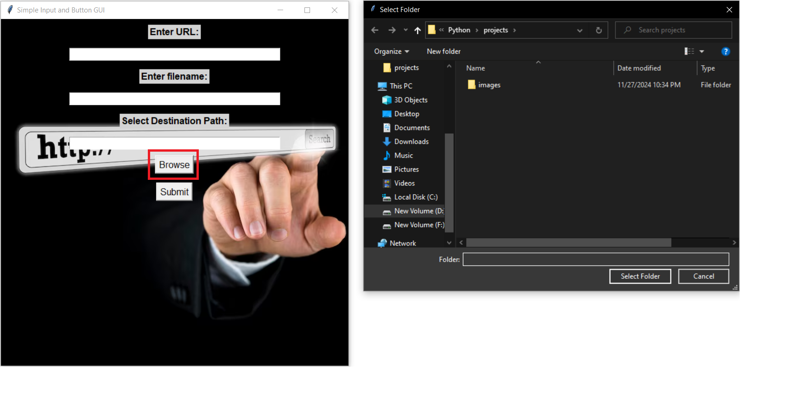

# URL File Downloader - User Manual

---

## Prerequisites & Requirements

Before using the URL File Downloader application, make sure you have the following installed:

- *Python 3.x* or higher
- *Libraries:* 
  - requests
  - tkinter

---

## Installation Steps

Follow these steps to get the URL File Downloader application running:

1. *Clone or download* the project to your local machine.
2. *Navigate to the project directory.*
3. *Create a virtual environment (optional but recommended):*

    bash
    python -m venv venv
    

4. *Activate the virtual environment:*
    - For *Windows*:

        bash
        venv\Scripts\activate
        

    - For *Linux/macOS*:

        bash
        source venv/bin/activate
        

5. *Install required dependencies:*

    bash
    pip install -r requirements.txt
    

6. *Run the application:*

    bash
    python file_downloader.py
    

---

## How to Use the URL File Downloader

Follow these steps to use the application:

1. Open the application by running the Python script.
2. In the application window, enter the URL of the file you want to download.
3. Enter the filename that you want the downloaded file to be saved as.
4. Click the "Browse" button to choose the destination folder for the downloaded file.
5. Click the "Submit" button to start the download process.

---

## Features

The URL File Downloader comes with the following key features:

- *Download from any URL* – Allows users to download files from any URL.
- *Choose Destination Path* – Users can specify where the downloaded file should be saved.
- *Simple User Interface* – Intuitive UI with easy input fields and buttons for browsing and submitting.
- *Cross-Platform Support* – Works on both Windows and Linux operating systems.

---

## Screenshots

Here are some screenshots of the URL File Downloader in action:

  

  

---

## Troubleshooting

If you encounter any issues, here are some common solutions:

- *Problem:* "ValueError: Amount must be greater than zero."  
  *Solution:* Make sure you enter a valid positive number for the amount.

- *Problem:* "TypeError: Data is empty."  
  *Solution:* Ensure you have added some entries before trying to calculate profit or loss.

- *Problem:* "ModuleNotFoundError" or missing libraries.  
  *Solution:* Install missing dependencies using:

    bash
    pip install -r requirements.txt
    

---

## Contact Support

If you need additional help, feel free to contact us:

- *Email:* [govindgupta057@gmail.com](mailto:govindgupta057@gmail.com.com)
- *GitHub Repository:* [https://github.com/Govindg1211/budget-tracker](https://github.com/Govindg1211/budget-tracker)

We are happy to assist you with any questions or issues you may have!

---

&copy; 2024 Budget Tracker | All Rights Reserved
